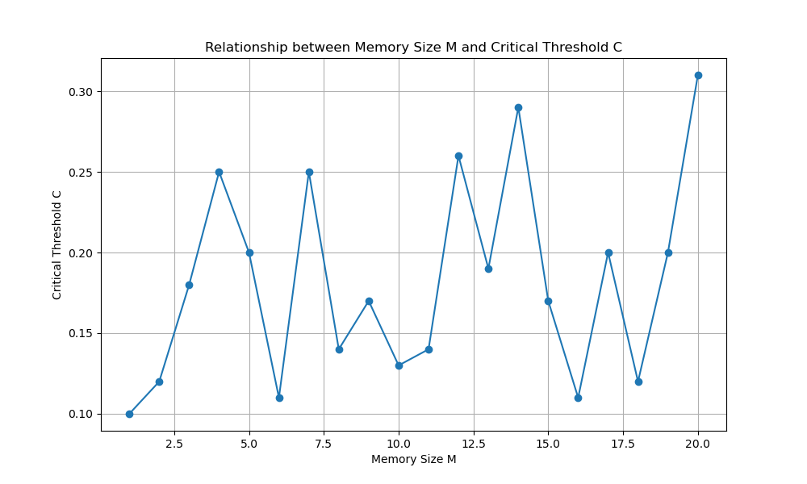

# Information-Spread-Threshold-Model
Information-Spread-Threshold-Model

## 问题描述

1. 阅读本周参考资料。
 
2. 1中的参考资料中提到，当网络稀疏化后，临界阈值会明显变小。但需要注意的是，其设定仍然是均匀网络，即所有节点度是一样的。现考虑在真实的网络（稀疏，不均匀）中对其理论模型进行仿真，并观察不同的M下，是否会出现所谓的“社会习惯”变化，即得到临界阈值与M的关系（如1中的图Fig1(B)）。真实的社交网络可使用http://snap.stanford.edu/data/gemsec-Deezer.html中提到的数据。另外，仿真轮数等参数可以按1做类似设定。

## 实现思路

主要按照4个步骤进行：

1. 加载网络数据，通过 load_network_data 函数完成。从CSV文件中读取边信息，并构建一个无向图，作为模拟的基础网络结构。

2. 为了确保仿真的效率和满足“不均匀 稀疏”特点，通过 extract_connected_subgraph 函数从原始网络中抽取一个连通的子图。使网络的规模更适中，而且通过调整网络的稀疏性参数，使得子图更符合真实世界网络的特性。

3. 通过 simulate_threshold_model 函数实现模拟。这个函数接收子图以及不同的模型参数，如记忆长度M和承诺阈值C，并执行多轮模拟以观察信息如何在网络中传播。模拟过程中，节点会根据邻居的状态更新自己的状态，模拟阈值模型。

4. 通过 process_m_value 函数分析结果，该函数尝试找到当所有传统节点都接受新状态的最小承诺阈值C。对于每个内存大小M，函数评估并记录能够触发全面状态转变的C值。整个模拟结束后，通过 save_results_to_file 函数将结果保存到文件中。

## 实现代码

### 仿真模拟部分

```python
import networkx as nx
import csv
import random

random.seed(3407)

def extract_connected_subgraph(graph, target_size=300, sparsity=0.8):
    """Extract a sparse and unevenly connected subgraph from the provided graph."""
    print("Extracting connected subgraph...")
    nodes = list(graph.nodes())
    weights = [deg for _, deg in graph.degree()]
    selected_nodes = random.choices(nodes, weights=weights, k=target_size)
    
    subgraph = nx.Graph(graph.subgraph(selected_nodes))
    edges_to_remove = random.sample(list(subgraph.edges()), int(len(subgraph.edges()) * (1 - sparsity)))
    subgraph.remove_edges_from(edges_to_remove)
    
    ensure_graph_connectivity(subgraph)
    print("Subgraph extraction complete.")
    return subgraph

def ensure_graph_connectivity(graph):
    """Ensure that the graph is connected, adding edges if necessary."""
    if not nx.is_connected(graph):
        print("Subgraph is not connected, adding edges...")
        for component in nx.connected_components(graph):
            connect_components(graph, component)

def connect_components(graph, component):
    """Connect disconnected components in the graph."""
    connected_components = list(nx.connected_components(graph))
    while len(connected_components) > 1:
        first_component = connected_components.pop()
        second_component = connected_components[0]
        graph.add_edge(random.choice(list(first_component)), random.choice(list(second_component)))

def simulate_threshold_model(graph, commitment_threshold, memory_size, num_rounds=1000):
    """Simulate the threshold model on the graph."""
    print(f"Model parameters: C={commitment_threshold}, M={memory_size}, T={num_rounds}")
    total_nodes = len(graph.nodes())
    memory_state = {node: ['A'] * memory_size for node in graph.nodes()}
    committed_nodes = set(random.sample(list(graph.nodes()), int(commitment_threshold * total_nodes)))
    
    simulate_information_spread(graph, committed_nodes, memory_state, memory_size, num_rounds)
    return calculate_conversion_rate(graph, committed_nodes, memory_state, memory_size)

def simulate_information_spread(graph, committed_nodes, memory_state, memory_size, num_rounds):
    """Simulate the spread of information across the graph."""
    num_edges = len(graph.edges())
    num_nodes = len(graph.nodes())
    sample_size = min(num_edges, num_nodes)  # Ensure the sample size does not exceed the number of edges
    for _ in range(num_rounds):
        for edge in random.sample(list(graph.edges()), sample_size):
            speaker, hearer = random.choice([(edge[0], edge[1]), (edge[1], edge[0])])
            propagate_information(speaker, hearer, memory_state, memory_size, committed_nodes)

def propagate_information(speaker, hearer, memory_state, memory_size, committed_nodes):
    """Propagate information from speaker to hearer based on their memory state."""
    message = 'A' if memory_state[speaker].count('B') <= memory_size / 2 else 'B'
    if hearer not in committed_nodes:
        memory_state[hearer].pop(0)
        memory_state[hearer].append(message)

def calculate_conversion_rate(graph, committed_nodes, memory_state, memory_size):
    """Calculate the conversion rate of non-committed nodes."""
    non_committed_nodes = set(graph.nodes()) - committed_nodes
    converted_count = sum(1 for node in non_committed_nodes if memory_state[node].count('B') > memory_size / 2)
    return converted_count / len(non_committed_nodes)

def load_network_data(file_path):
    """Load network data from a CSV file."""
    graph = nx.Graph()
    with open(file_path, 'r') as file:
        csv_reader = csv.reader(file)
        next(csv_reader)  # Skip the header
        for row in csv_reader:
            graph.add_edge(int(row[0]), int(row[1]))
    return graph

def main():
    print("Loading network data...")
    graph = load_network_data("./deezer_clean_data/RO_edges.csv")
    print("Network data loaded.")

    M = 21
    subgraph = extract_connected_subgraph(graph)
    results = []
    print("Starting parameter search simulation...")
    for m in range(1, M):
        result = process_m_value((subgraph.copy(), m))
        if result:
            results.append(result)
    print("Simulation parameter search complete.")
    
    print("Saving results to file...")
    save_results_to_file('result_1000.csv', results)
    print("Results saved.")

def process_m_value(params):
    graph, m = params
    print("Starting simulation for subgraph...")
    for c in range(10, 100):
        p = simulate_threshold_model(graph, c/100, m)
        if p == 1:
            print(f"Threshold model parameter found: C={c/100}, M={m}")
            return m, c/100
    print("No suitable threshold model parameter found.")
    return None

def save_results_to_file(filename, results):
    """Save the simulation results to a CSV file."""
    with open(filename, 'w', newline='') as file:
        writer = csv.writer(file)
        writer.writerow(['M', 'C'])
        for result in results:
            writer.writerow(result)

if __name__ == '__main__':
    main()
```

### 数据可视化部分

```python
import pandas as pd
import matplotlib.pyplot as plt

# Load the results data from the CSV file
results_file_path = './result——300.csv'
results_data = pd.read_csv(results_file_path)

# Display the first few rows of the data to understand its structure
results_data.head()

# Create a plot of M vs C
plt.figure(figsize=(10, 6))
plt.plot(results_data['M'], results_data['C'], marker='o')
plt.title('Relationship between Memory Size M and Critical Threshold C')
plt.xlabel('Memory Size M')
plt.ylabel('Critical Threshold C')
plt.grid(True)
plt.show()
```

## 结果与讨论

代码运行结果如下：



从图中可以看到，随着 Memory 的增加，临界阈值 C 呈现出波动性上升的变化。和参考资料中提到的“当网络稀疏化后，临界阈值会明显变小”结论不同：

实际数据显示临界阈值与 M 的关系可能更复杂，即波动形变化趋势，这可能是因为网络的不均匀性以及模拟的稀疏性处理方式影响了结果。稀疏和不均匀的网络可能导致信息传播的非线性阈值行为，这是与理论模型中均匀网络的简化假设不同导致的，从以下三个角度分析具体的原因：

1. 在均匀网络中，所有节点的度（即连接的数量）相同，这导致信息传播行为相对可预测和一致。然而，使用的真实社交网络是高度不均匀的，其中某些节点（称为中心节点或枢纽节点）拥有远多于平均水平的连接。这种结构的结果是，一方面，中心节点对信息传播的强影响，这些节点可以迅速影响其众多邻居，从而在某些情况下加速达到临界质量，降低所需的 C 值；另一方面，会产生非线性传播效应。中心节点可能导致传播行为出现非线性特征，尤其是在社会习惯开始转变时。

2. 同时从稀疏网络角度考虑，连接相对较少，对信息的传播速度和范围有显著影响。在稀疏网络中，一方面，增加传播难度，较少的连接可能导致需要更高的 C 值来实现广泛的状态转变，因为信息不太可能覆盖到大部分节点。另一方面，增加传播的不确定性，连接的随机性和稀疏性可能导致传播结果出现较大的波动，特别是在不同 M 值的模拟中。

3. 在上述两方面的影响下，记忆长度 M 表示节点记忆过去信息状态的能力，这直接影响了个体如何响应周围的社会信号。增加 M 可能允许节点更多地积累过去的信息，从而可能需要更多的时间或更多的 ‘B’ 状态输入来改变其当前状态。这导致了某些 M 值下观察到的较高 C。较小的 M 表示节点的响应更多地依赖于最近的输入，可能导致状态转变更加频繁或突然，从而在某些情况下降低 C。

